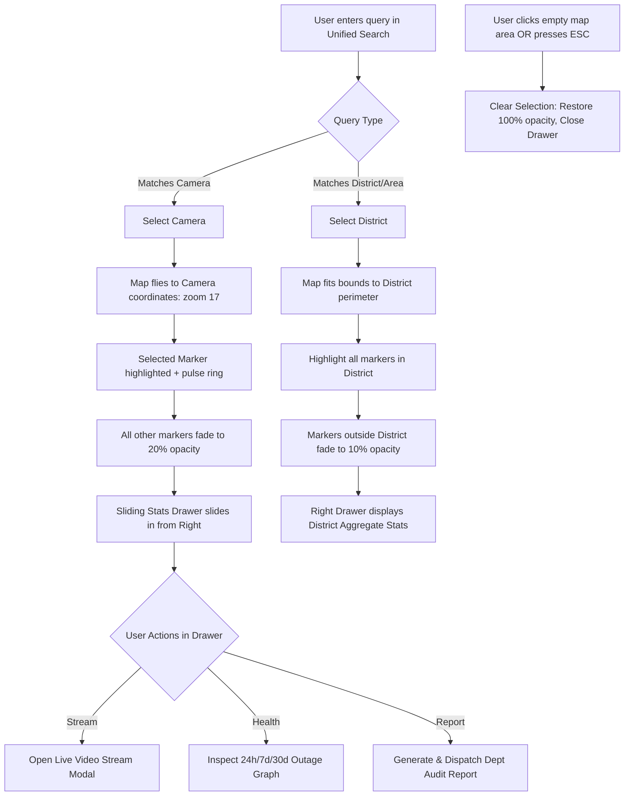

# DrishtiGrid — GIS Camera Search, Filtering, Coverage/Health Analytics & Reporting Upgrade
## Architecture Analysis & Technical Implementation Plan

---

## 1. Executive Summary

The **DrishtiGrid Gujarat State Surveillance Platform** currently provides geospatial visualization of surveillance cameras across Gujarat using React-Leaflet, Leaflet.markercluster, Express, and MongoDB. The system can render and cluster up to 1,500+ CCTV nodes and inspect live RTSP/HLS streams.

This implementation plan specifies a comprehensive upgrade covering:
1. **Unified Search & Autocomplete**: Instant search distinguishing individual CCTV units from administrative areas/districts, with spatial camera fly-to and district bounding-box zooming.
2. **Context-Preserving Map Highlighting**: Visual emphasis for selected cameras and regions with smooth opacity fading/desaturation of non-matching contextual nodes.
3. **Sliding Statistics Panel**: A rich, dismissible right-side analytics drawer displaying camera telemetry, hardware specs, uptime ratios, or aggregate district-level breakdowns without destructive map reflows.
4. **Multi-Dimensional Filter Bar**: Compound filtering by operational status, camera type/optics, administrative district, and owning department.
5. **Geospatial Coverage Gap Analysis**: Algorithmic detection of surveillance blind spots using radial density and bounding cluster voids, visualized via overlay heatmaps/gap-polygons with PDF/Excel export.
6. **Camera Health & Outage Telemetry**: Tracking per-camera downtime, mean time between failures (MTBF), outage incident counts, and uptime percentages across variable temporal windows (24h, 7d, 30d, custom).
7. **Departmental Automated Report Routing & Dispatch**: Dynamic PDF/CSV report generation and automated routing to departmental liaisons (Police, Traffic, Municipal Corporation) with full cryptographic/audit logging.

---

## 2. Current Architecture Findings (Phase 1 Discovery)

### 2.1 GIS & Mapping Layer
- **Mapping Framework**: Leaflet (`v1.9.4`) with `react-leaflet` (`v5.0.0`) wrapped in [`client/src/pages/GISMapPage.jsx`](file:///c:/Users/NISHANT/.antigravity-ide/DrishtiGrid/client/src/pages/GISMapPage.jsx).
- **Marker Layer & Clustering**: Implemented in [`client/src/components/map/CameraClusterLayer.jsx`](file:///c:/Users/NISHANT/.antigravity-ide/DrishtiGrid/client/src/components/map/CameraClusterLayer.jsx) using `leaflet.markercluster` (`v1.5.3`). Markers use custom HTML via `L.divIcon` with CSS pulse rings and SVG camera glyphs.
- **Administrative Area Representation**: Currently, **no GeoJSON boundaries, district polygons, or administrative shapefiles exist**. Districts and talukas are stored strictly as scalar string attributes on camera documents (`camera.district`, `camera.address.district`, `camera.taluka`). Area lists in the UI are computed dynamically via client-side `Set` operations over fetched cameras.
- **Spatial Interactions**: The map initializes at Gujarat coordinates `[22.4, 71.9]` (zoom level 7). Markers support click popups displaying status, hardware info, and buttons triggering `cctv:open-stream` or navigating to `/footage-requests`. There is currently **no viewport fly-to, polygon boundary drawing, or multi-element selection highlighting**.

### 2.2 Data Model & Persistence
- **Camera Schema** ([`server/src/models/Camera.js`](file:///c:/Users/NISHANT/.antigravity-ide/DrishtiGrid/server/src/models/Camera.js)):
  - Geospatial: `location: { type: 'Point', coordinates: [lng, lat] }` with `2dsphere` indexing. Latitude and longitude are also redundantly stored at top level.
  - Hierarchy & Address: `address: { full, street, area, city, district, taluka, state, pincode }`, `locationName`, `landmark`, `roadName`.
  - Specs & Optics: `type` (PTZ, Fixed, Dome, Bullet, Fisheye, Thermal), `camera_model`, `brand`, `model`, `resolution`, `fps`, `coverageAngle` (default 90°), `coverageRadius` (default 50m), `heading`, `mountingHeight`.
  - Operational Status: `status` (`online`, `offline`, `maintenance`, `fault`), `lastHeartbeat` (Date), `uptime` (Number, static percentage).
  - Administration: `departmentName` (free-text string), `assignedTo` (ObjectId ref User), `policeStation`, `district` (String, required).
- **Normalization Gap**:
  - `departmentName` is an unstructured string (`Camera.js:71`). No dedicated `Department` collection or foreign key references exist.
  - `district` is a raw string on both `Camera` and `User`.
- **Status History & Uptime Gap**:
  - **No historical status logs exist**. The system stores only current snapshot status and a single `uptime` number. Downtime durations, outage incidents, and historical intervals are not recorded.
- **Existing Reporting & Document Generation**:
  - [`client/src/pages/ReportsPage.jsx`](file:///c:/Users/NISHANT/.antigravity-ide/DrishtiGrid/client/src/pages/ReportsPage.jsx) has a dummy `Export CSV` button triggering a `toast.success` notification and a `Print Report` button triggering native `window.print()`.
  - Neither `jspdf`, `pdfmake`, `xlsx`, `exceljs`, nor `papaparse` is installed in `client/package.json` or `server/package.json`.
- **Notification & Dispatch Infrastructure**:
  - In-app notification schema exists in [`server/src/models/Notification.js`](file:///c:/Users/NISHANT/.antigravity-ide/DrishtiGrid/server/src/models/Notification.js) and is pushed in real-time via Socket.IO ([`server/src/socket/socketHandler.js`](file:///c:/Users/NISHANT/.antigravity-ide/DrishtiGrid/server/src/socket/socketHandler.js)).
  - **No SMTP or email transport exists**. Neither `nodemailer`, `@sendgrid/mail`, nor any mailgun/SES adapter is present in `server/package.json`.

### 2.3 Search
- **Current Mechanism**: Client-side filtering in [`GISMapPage.jsx:56-84`](file:///c:/Users/NISHANT/.antigravity-ide/DrishtiGrid/client/src/pages/GISMapPage.jsx#L56-L84) using JavaScript `String.prototype.includes()` over an in-memory array of up to 1,000 fetched cameras.
- **Query Targets**: Matches against camera name, ID, road name, landmark, taluka, district, and model.
- **Limitations**: No autocomplete dropdown, no distinction between administrative jurisdictions and individual cameras, no server-side index utilization, and no spatial bounds fly-to upon query matching.

### 2.4 Frontend Architecture
- **Tech Stack**: React 19, Vite 6, TailwindCSS v4, Zustand 5 (`authStore.js`, `themeStore.js`), TanStack Query 5.
- **Styling Paradigm**: TailwindCSS classes utilizing custom dark/light theme tokens (`bg-[#0a0d14]`, `bg-white/4`, `border-white/8`, `backdrop-blur-md`).
- **Layout Consistency**: Application resides inside [`client/src/components/layout/DashboardLayout.jsx`](file:///c:/Users/NISHANT/.antigravity-ide/DrishtiGrid/client/src/components/layout/DashboardLayout.jsx) featuring a 64px collapsed / 256px expanded left navigation drawer and a sticky glassmorphic top header. The GIS map operates in full viewport height (`h-full flex-1`).

### 2.5 Department Modeling
- **Entities**:
  - User model ([`server/src/models/User.js`](file:///c:/Users/NISHANT/.antigravity-ide/DrishtiGrid/server/src/models/User.js)) defines roles: `ADMIN`, `POLICE`, `TRAFFIC_POLICE`, alongside free-text `department` and `district`.
  - Camera documents have `departmentName: String` (commonly populated with values like "Gujarat Police", "Traffic Branch", "Ahmedabad Municipal Corporation", "Smart City Command Centre").
  - There is no central registry mapping departments to official nodal officers, notification emails, or escalation matrices.

---

## 3. Gaps vs. Requirements Matrix

| Feature | Current State | Target State | Gap / Needed Work |
| :--- | :--- | :--- | :--- |
| **3.1 Unified Search Bar** | Simple text input filtering array in-place. No suggestions. | Dual-category autocomplete dropdown (Cameras vs. Districts/Areas) with spatial fly-to. | Autocomplete component, categorized suggestions, Leaflet `flyTo` / `flyToBounds` integration. |
| **3.2 Focus & Highlighting** | Click opens standard Leaflet popup. Unselected markers stay bright. | Selected node/area highlighted (scale, pulsing ring, color glow). Unselected markers fade to 20% opacity. | Dynamic CSS classes in `L.divIcon`, map click dismiss handler, cluster layer style override. |
| **3.3 Sliding Stats Panel** | Popup balloon only (`createPopupContent`). No sliding drawer. | 400px wide slide-in drawer on right with telemetry, live feed thumbnail, specs, or district breakdown. | Right drawer component with smooth CSS translate, collapsible, non-destructive to map container. |
| **3.4 Compound Filter Panel** | Separate individual `<select>` tags for Status, Type, District. | Unified glassmorphic filter toolbar with multi-select badges, department filter, and dynamic counters. | Add Department filter, multi-criteria compound predicate, visual badge bar with clear-all triggers. |
| **3.5 Coverage Gap Analysis** | Hardcoded coverage radius (50m) in schema, not rendered or analyzed. | Blind spot detection algorithm based on road/district bounds vs. camera coverage radii; heatmap/buffer layer. | Server-side/client-side spatial density analysis, Leaflet circle buffer/heatmap overlay, gap report generator. |
| **3.6 Camera Health Analysis** | Single static `uptime` number and `status` field. | Historical telemetry tracking downtime durations, incident frequency, MTBF, and uptime across 24h/7d/30d. | New `CameraHealthLog` model, heartbeat recording route, cron health evaluator, analytics API endpoints. |
| **3.7 Reporting & Dispatch** | Non-functional mock CSV toast; `window.print()` only. | Formatted PDF/Excel generator with camera/district audit, gap logs, and automated email dispatch with audit trail. | Add PDF/Excel generation utility (`pdfmake` or `jspdf` / `exceljs`), SMTP transport (`nodemailer`), dispatch audit log. |

---

## 4. Proposed Data Model Changes

### 4.1 New Collection: `CameraHealthLog`
Tracks state transitions and periodic health snapshots to enable precise downtime and MTBF analytics over arbitrary time windows.

```javascript
// server/src/models/CameraHealthLog.js
const mongoose = require('mongoose');

const cameraHealthLogSchema = new mongoose.Schema(
  {
    cameraId: {
      type: String,
      required: true,
      index: true,
    },
    cameraRef: {
      type: mongoose.Schema.Types.ObjectId,
      ref: 'Camera',
      required: true,
      index: true,
    },
    previousStatus: {
      type: String,
      enum: ['online', 'offline', 'maintenance', 'fault', 'unknown'],
      required: true,
    },
    currentStatus: {
      type: String,
      enum: ['online', 'offline', 'maintenance', 'fault'],
      required: true,
      index: true,
    },
    eventTimestamp: {
      type: Date,
      default: Date.now,
      index: true,
    },
    downtimeDurationSeconds: {
      type: Number,
      default: 0, // Recorded when transitioning back to online
    },
    reason: String, // e.g. "RTSP Connection Timeout", "Network Packet Loss", "Manual Maintenance"
    pingLatencyMs: Number,
    packetLossPercent: Number,
  },
  { timestamps: true }
);

cameraHealthLogSchema.index({ cameraRef: 1, eventTimestamp: -1 });
cameraHealthLogSchema.index({ currentStatus: 1, eventTimestamp: -1 });
```

### 4.2 New Collection: `Department` (Normalized Registry)
Provides formal department entities, official nodal officer contacts, and automatic report routing emails.

```javascript
// server/src/models/Department.js
const mongoose = require('mongoose');

const departmentSchema = new mongoose.Schema(
  {
    code: {
      type: String,
      required: true,
      unique: true,
      uppercase: true, // e.g., 'POLICE', 'TRAFFIC', 'AMC', 'RTO', 'FOREST'
      trim: true,
    },
    name: {
      type: String,
      required: true, // e.g., "Gujarat State Police Department"
    },
    category: {
      type: String,
      enum: ['Law Enforcement', 'Traffic Management', 'Municipal Corporation', 'Emergency Services', 'Transport'],
      required: true,
    },
    contactEmail: {
      type: String,
      required: true,
      trim: true,
      match: [/^\S+@\S+\.\S+$/, 'Invalid email address'],
    },
    secondaryEmail: String,
    nodalOfficer: {
      name: String,
      designation: String,
      phone: String,
    },
    jurisdictionDistricts: [String], // Array of district names governed
    reportSchedule: {
      enabled: { type: Boolean, default: false },
      frequency: { type: String, enum: ['daily', 'weekly', 'monthly'], default: 'weekly' },
      timeOfDay: { type: String, default: '08:00' }, // HH:mm
    },
    isActive: { type: Boolean, default: true },
  },
  { timestamps: true }
);
```

### 4.3 New Collection: `ReportDispatchLog`
Provides an immutable compliance and audit trail for generated and routed analytical reports.

```javascript
// server/src/models/ReportDispatchLog.js
const mongoose = require('mongoose');

const reportDispatchLogSchema = new mongoose.Schema(
  {
    reportType: {
      type: String,
      enum: ['HEALTH_AUDIT', 'COVERAGE_GAP', 'COMBINED_DEPARTMENT_AUDIT', 'INCIDENT_SUMMARY'],
      required: true,
    },
    targetDepartment: {
      type: String,
      required: true,
    },
    recipientEmails: [{
      type: String,
      required: true,
    }],
    generatedBy: {
      type: mongoose.Schema.Types.ObjectId,
      ref: 'User',
      required: false, // null if scheduled system cron
    },
    generationTrigger: {
      type: String,
      enum: ['MANUAL_USER', 'SCHEDULED_CRON', 'HEALTH_ALERT_AUTOMATION'],
      default: 'MANUAL_USER',
    },
    format: {
      type: String,
      enum: ['PDF', 'EXCEL', 'CSV'],
      default: 'PDF',
    },
    parameters: {
      district: String,
      dateRangeStart: Date,
      dateRangeEnd: Date,
      minUptimeThreshold: Number,
      gapSeverity: String,
    },
    fileMetadata: {
      fileName: String,
      fileSizeBytes: Number,
      storageUrl: String,
      hashSha256: String, // Forensic integrity hash
    },
    deliveryStatus: {
      type: String,
      enum: ['PENDING', 'SENT', 'FAILED'],
      default: 'PENDING',
    },
    smtpMessageId: String,
    errorMessage: String,
  },
  { timestamps: true }
);

reportDispatchLogSchema.index({ targetDepartment: 1, createdAt: -1 });
reportDispatchLogSchema.index({ deliveryStatus: 1 });
```

### 4.4 Schema Enhancements to `Camera.js`
Minor non-breaking additions to support standardized department tagging and geometric bounds:

```javascript
// Additions to Camera.js schema:
departmentId: {
  type: mongoose.Schema.Types.ObjectId,
  ref: 'Department',
  index: true,
},
// Normalized department identifier enum for fast grouping
departmentCode: {
  type: String,
  enum: ['POLICE', 'TRAFFIC', 'MUNICIPAL', 'TRANSPORT', 'HIGHWAY_PATROL', 'OTHER'],
  default: 'POLICE',
  index: true,
},
healthMetrics: {
  uptime24h: { type: Number, default: 100 },
  uptime7d: { type: Number, default: 100 },
  uptime30d: { type: Number, default: 100 },
  lastOfflineAt: Date,
  totalOutagesCount: { type: Number, default: 0 },
  longestOutageMinutes: { type: Number, default: 0 },
}
```

---

## 5. Proposed Component & API Specifications

### 5.1 Unified Search Bar & Autocomplete (`UnifiedSearchBar.jsx`)
- **Visual Location**: Positioned in top toolbar of `GISMapPage.jsx`.
- **Functionality**:
  - Combined search for:
    - **Camera Results**: Match `cameraId`, `name`, `cameraName`, `locationName`, `roadName`, `landmark`. Display camera icon + status pill + district badge.
    - **Area Results**: Match unique `district` names, `taluka` names, and major highway/road corridors. Display region icon + camera count badge (e.g., `"Ahmedabad District (245 cameras)"`).
  - Keyboard navigation (Arrow keys, Enter, Escape).
- **Map Interaction on Selection**:
  - If **Camera**: Invoke `map.flyTo([lat, lng], 17, { duration: 1.2 })`, open selection highlight, trigger right sliding statistics panel.
  - If **Area/District**: Calculate bounding box `L.latLngBounds` for all camera coordinates belonging to that district; invoke `map.fitBounds(bounds, { padding: [50, 50], maxZoom: 14 })`. Dim markers outside the district.

### 5.2 Context-Preserving Highlighting & Fading
- **CSS Variable / Class Driven**:
  - Add `.gis-context-dimmed` class to marker containers or map layer wrapper.
  - Dimmed state: `opacity: 0.22; filter: grayscale(80%) blur(0.2px); transition: all 300ms cubic-bezier(0.4, 0, 0.2, 1);`
  - Selected marker: `transform: scale(1.35); z-index: 1000 !important; filter: drop-shadow(0 0 16px rgba(6, 182, 212, 0.9));`
  - Unhighlighting triggers: Clicking an empty map region, clicking the "Clear Selection" button in the stats drawer, or pressing Escape.

### 5.3 Sliding Right Statistics Panel (`GISStatsDrawer.jsx`)
- **UX Form Factor**: 420px wide slide-in overlay anchored to the right side of the map viewport.
- **Positioning**: Fixed within map container (`absolute right-0 top-0 bottom-0 z-[1000]`), overlaying the map with glassmorphism (`bg-[#0e1322]/95 backdrop-blur-xl border-l border-white/10 shadow-2xl`). Map does not permanently reflow, preventing layout jumps.
- **Content Modes**:
  1. **Camera Detail Mode**:
     - Status header with live badge, uptime ring indicator (24h / 7d / 30d).
     - Camera ID, RTSP/HLS stream specs, resolution, brand, lens coverage radius (50m).
     - Owning department, contact nodal officer, police station jurisdiction.
     - Outage history summary (last offline timestamp, outage count).
     - Quick actions: "Watch Live Stream", "Request Forensic Footage", "Download Health Certificate".
  2. **Area / District Summary Mode**:
     - Total camera inventory in area.
     - Operational breakdown: Online %, Offline count, Maintenance alerts.
     - Department breakdown: Police vs Traffic vs Smart City share.
     - Coverage density indicator: Cameras/sq km and estimated blind spot percentage.
     - Action: "Export Area Coverage Audit (PDF)".

### 5.4 Multi-Criteria Filter Bar (`GISFilterToolbar.jsx`)
- **Filters Supported**:
  - **Status**: Multi-toggle pills: `All`, `Online`, `Offline`, `Maintenance`, `Fault`.
  - **Camera Type**: PTZ, Fixed, Dome, Bullet, Fisheye, Thermal.
  - **District**: Autocomplete search select covering all 33 Gujarat administrative districts.
  - **Department**: Police, Traffic Branch, Municipal Corp, Smart City, Transport.
- **Integration**: Operates with AND logic. Non-matching cameras on the map fade to `opacity: 0.1` rather than disappearing completely, allowing operators to understand overall density while focusing on filtered subsets.

### 5.5 Coverage Gap Analysis Engine
- **Methodology**:
  - **Grid-Radius Proximity Analysis**: Given a target district or bounding box, calculate the union of camera coverage buffers (`coverageRadius` = 50m to 250m depending on camera type).
  - Areas with zero overlapping visual buffers along arterial roadways or within populated municipal grid zones are identified as **Blind Spot Zones**.
  - **Density Scoring**: Cameras per 1,000 population or cameras per km of road network.
- **Visualization**:
  - Toggleable Leaflet Layer: Semi-transparent amber/red circular buffers around existing cameras (`L.circle` with `fillColor: '#06b6d4'`, `fillOpacity: 0.15`).
  - Blind spot density overlay: Polygons or heatmap cluster overlays highlighting unmonitored clusters.
- **Gap Reporting**:
  - Exports a ranked list of top coverage voids with recommended new installation coordinates, nearest police station, and priority ranking (Critical, High, Medium).

### 5.6 Camera Health Telemetry System
- **Downtime Calculation**:
  - Real-time uptime score:
    $$\text{Uptime \%} = \left(1 - \frac{\text{Total Offline Seconds in Period}}{\text{Total Seconds in Period}}\right) \times 100$$
  - Outage incident counter: Incremented each time a heartbeat check fails or RTSP stream disconnects.
  - MTBF (Mean Time Between Failures): Total operating hours divided by number of outage events.
- **Background Cron**:
  - Periodic worker running via `node-cron` in Express (`server/src/workers/healthMonitorWorker.js`) every 5 minutes:
    - Queries camera status or ping response.
    - Records state transitions to `CameraHealthLog`.
    - Updates rolling averages in `Camera.healthMetrics`.

### 5.7 Automated Report Generation & Email Dispatch System
- **Report Engine**:
  - Server-side PDF generation using `pdfmake` or `puppeteer-core` / HTML-to-PDF template.
  - Excel generation using `exceljs` for multi-tab analytical spreadsheets (Tab 1: Executive KPI Summary, Tab 2: Camera Health Telemetry, Tab 3: Coverage Gap Coordinates).
- **Email Dispatch Pipeline**:
  - Transport: `nodemailer` configuring standard SMTP credentials from environment variables (`SMTP_HOST`, `SMTP_PORT`, `SMTP_USER`, `SMTP_PASS`, `SMTP_FROM`).
  - Automated routing: Looks up target `Department` record by `departmentCode`, retrieves `contactEmail` and `secondaryEmail`, attaches generated PDF/Excel document, and dispatches.
  - Auditing: Writes full transaction record to `ReportDispatchLog` with SHA-256 integrity hash of the attachment.

---

## 6. API Endpoint Contracts to Introduce

### `GET /api/v1/cameras/gis/search-suggestions`
Provides instant autocomplete suggestions for search input.
- **Query Params**: `q` (string, min 2 chars), `limit` (default 10)
- **Response**:
```json
{
  "success": true,
  "data": {
    "cameras": [
      { "cameraId": "GJ-AMD-0042", "name": "SG Highway Junction Dome", "district": "Ahmedabad", "type": "Dome", "status": "online", "coordinates": [72.5074, 23.0338] }
    ],
    "areas": [
      { "name": "Ahmedabad", "type": "district", "cameraCount": 384, "boundingBox": [[22.8, 72.3], [23.3, 72.8]] },
      { "name": "SG Highway Corridor", "type": "corridor", "cameraCount": 46, "boundingBox": [[23.0, 72.5], [23.15, 72.55]] }
    ]
  }
}
```

### `GET /api/v1/analytics/coverage-gaps`
Calculates coverage density and blind spots.
- **Query Params**: `district` (string, optional), `radiusMeters` (default 100), `gridResolution` (default 500)
- **Response**:
```json
{
  "success": true,
  "data": {
    "district": "Ahmedabad",
    "totalCameras": 384,
    "coveredAreaSqKm": 124.5,
    "estimatedBlindSpotPercentage": 34.2,
    "topGapClusters": [
      {
        "clusterId": "GAP-AMD-01",
        "approximateLocation": "Sardar Patel Ring Road West",
        "coordinates": [72.4812, 23.0511],
        "radiusMeters": 650,
        "severity": "CRITICAL",
        "recommendedCams": 4,
        "nearestStation": "Vastrapur Police Station"
      }
    ]
  }
}
```

### `GET /api/v1/analytics/camera-health/:cameraId`
Retrieves granular uptime telemetry and historical outages.
- **Query Params**: `timeframe` (`24h` | `7d` | `30d` | `custom`), `startDate`, `endDate`
- **Response**:
```json
{
  "success": true,
  "data": {
    "cameraId": "GJ-AMD-0042",
    "timeframe": "7d",
    "uptimePercentage": 99.4,
    "totalOutages": 2,
    "totalDowntimeMinutes": 61,
    "longestOutageMinutes": 45,
    "lastOfflineTimestamp": "2026-09-05T14:20:00.000Z",
    "events": [
      { "timestamp": "2026-09-05T14:20:00.000Z", "durationMinutes": 45, "reason": "Network Gateway Timeout" },
      { "timestamp": "2026-09-02T03:10:00.000Z", "durationMinutes": 16, "reason": "Power Supply Fluctuation" }
    ]
  }
}
```

### `POST /api/v1/reports/dispatch`
Generates and delivers compliance/audit reports to departmental nodal officers.
- **Request Body**:
```json
{
  "reportType": "COMBINED_DEPARTMENT_AUDIT",
  "departmentCode": "TRAFFIC",
  "district": "Surat",
  "timeframe": "30d",
  "format": "PDF",
  "sendEmail": true,
  "overrideRecipient": "traffic.surat@gujaratpolice.gov.in"
}
```
- **Response**:
```json
{
  "success": true,
  "data": {
    "dispatchId": "DSP-20260907-8841",
    "status": "SENT",
    "recipient": "traffic.surat@gujaratpolice.gov.in",
    "downloadUrl": "/api/v1/reports/download/DSP-20260907-8841.pdf",
    "dispatchedAt": "2026-09-07T11:40:00.000Z"
  }
}
```

---

## 7. UX & Interaction Flows



### 7.1 Visual Transition Timings
- **Marker Fade & Glow**: `transition: opacity 300ms ease, transform 300ms cubic-bezier(0.34, 1.56, 0.64, 1), filter 300ms ease;`
- **Right Drawer Slide**: `transform 350ms cubic-bezier(0.16, 1, 0.3, 1);` (Snappy entry, damped spring stop).
- **Map Camera Transition**: `duration: 1.2s`, `easeLinearity: 0.25` via Leaflet `flyTo`.

---

## 8. Open Questions & Product Decisions Needed

1. **District Geometries & Boundaries**:
   - *Question*: Are official GeoJSON boundary files available for Gujarat's 33 districts and talukas, or should we derive approximate bounding hulls from the convex hull of existing camera coordinates in each district?
   - *Recommendation*: Supply a standard Gujarat District GeoJSON file (`gujarat_districts.geojson`) to allow true polygon border highlighting. In the interim, convex bounding hulls can be computed dynamically.
2. **Coverage Gap Radius Metric**:
   - *Question*: Should the blind-spot analysis use fixed radial buffers (e.g. 50m for Bullet/Dome, 150m for PTZ, 300m for Highway Thermal), or should it account for road polyline coverage?
   - *Recommendation*: Use optical classification radius (50m Fixed, 150m PTZ) for Phase 1 of coverage analytics.
3. **Outage Detection Source**:
   - *Question*: Will camera online/offline statuses be pushed via an external VMS/SNMP monitoring feed, or should DrishtiGrid run an internal RTSP ping check / synthetic heartbeat worker?
   - *Recommendation*: Implement an internal synthetic ping/heartbeat evaluator with an open webhook receiver (`POST /api/v1/cameras/:id/heartbeat`) ready for external VMS integration.
4. **Email Delivery Provider**:
   - *Question*: Which corporate/government SMTP service or cloud mail provider (NIC Mail, AWS SES, SendGrid, custom SMTP relay) should be configured in production?
   - *Recommendation*: Support standard RFC-compliant SMTP environment variables (`SMTP_HOST`, `SMTP_PORT`, `SMTP_USER`, `SMTP_PASS`) so any government relay or transactional provider can be plugged in without code changes.

---

## 9. Risks & Dependencies

1. **Marker Clustering vs. Selection Highlighting**:
   - *Risk*: When a camera is selected or an area is filtered, its marker may be hidden inside a cluster at low zoom levels.
   - *Mitigation*: When a camera is selected from search or an external trigger, invoke `markerClusterGroup.zoomToShowLayer(marker, callback)` before applying the focus highlight.
2. **Performance with 1,500+ Camera Buffers**:
   - *Risk*: Rendering 1,500 interactive `L.circle` vector geometries simultaneously can cause browser canvas/DOM lag.
   - *Mitigation*: Only render coverage circles for visible markers within the current map viewport or when zoom level is $\ge 12$. Use HTML5 canvas tile renderer (`L.canvas()`) for vector shapes.
3. **PDF Generation Resource Footprint**:
   - *Risk*: Heavy server-side headless browsers (e.g. Puppeteer) can exhaust server RAM under concurrent requests.
   - *Mitigation*: Use lightweight pure JavaScript PDF generation via `pdfmake` with pre-compiled tabular layouts, running inside asynchronous worker jobs.

---

## 10. Suggested Phased Build Order / Milestones

### Milestone 1: Search, Highlighting & Filter Upgrades (Frontend Focus)
- Build `UnifiedSearchBar.jsx` with autocomplete for cameras and districts.
- Implement selection state, context dimming CSS, and `flyTo` / `fitBounds` camera navigation.
- Build `GISStatsDrawer.jsx` (camera details and district overview) without breaking map layout.
- Upgrade filter toolbar with department filters and compound predicate logic.

### Milestone 2: Health Monitoring & Telemetry (Full-Stack)
- Implement `CameraHealthLog.js` schema and indexing.
- Create `/api/v1/analytics/camera-health` endpoints.
- Build health telemetry sub-views in `GISStatsDrawer` with interactive timeframe selectors (24h/7d/30d).
- Implement background health evaluation worker in server.

### Milestone 3: Coverage Gap Analysis & Spatial Heatmap
- Implement spatial proximity/density evaluation algorithm.
- Add toggleable camera visual coverage circles and blind-spot heatmap overlay in Leaflet.
- Create `/api/v1/analytics/coverage-gaps` API.

### Milestone 4: Reporting, Export & Automated Dispatch
- Install and configure `pdfmake` and `exceljs` on server.
- Build formal audit templates (Camera Uptime, Coverage Gaps, Departmental Compliance).
- Configure `nodemailer` SMTP transport with retry and error fallback.
- Implement `ReportDispatchLog.js` and `/api/v1/reports/dispatch` API.
- Add "Export & Email Report" controls to the right drawer and main navigation.

---

## 11. Testing Strategy

| Module | Test Type | Method / Tool | Expected Acceptance Criteria |
| :--- | :--- | :--- | :--- |
| **Search Autocomplete** | Unit / Component | Vitest + React Testing Library | Typing "ahm" shows "Ahmedabad (District)" and matching cameras; Arrow keys navigate; Enter triggers selection. |
| **Marker Highlighting** | Visual / Integration | Cypress / Manual Browser Test | Selected marker scales 1.35x; unselected markers fade to opacity 0.22 within 300ms; clicking map background resets opacity to 1.0. |
| **Sliding Stats Panel** | Functional / Layout | Browser responsive testing | Panel slides in from right; map does not re-initialize or jump center; close button dismisses panel. |
| **Compound Filters** | Unit | Jest / Vitest predicate tests | Combining Status="offline" + District="Surat" + Dept="Traffic" yields exact intersection; empty results render zero-state gracefully. |
| **Health Telemetry API**| Integration | Supertest + MongoDB In-Memory | Health query for 7d accurately calculates uptime % matching logged downtime intervals; returns 200 with structured events. |
| **Report PDF & Dispatch**| End-to-End | Integration Test with Nodemailer Mock | PDF generates within < 1.5s; includes correct camera count and integrity hash; dispatch log entry recorded with status 'SENT'. |
